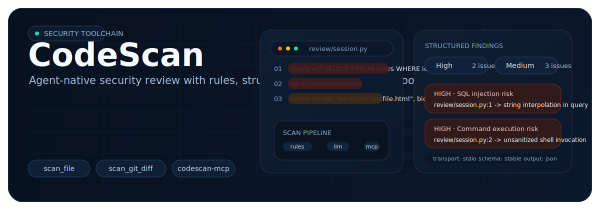
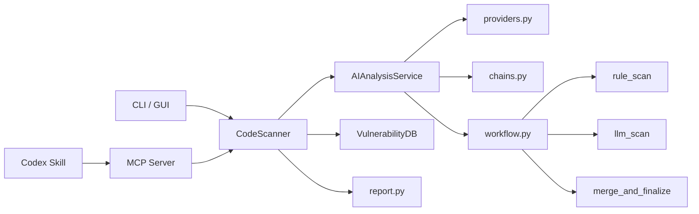
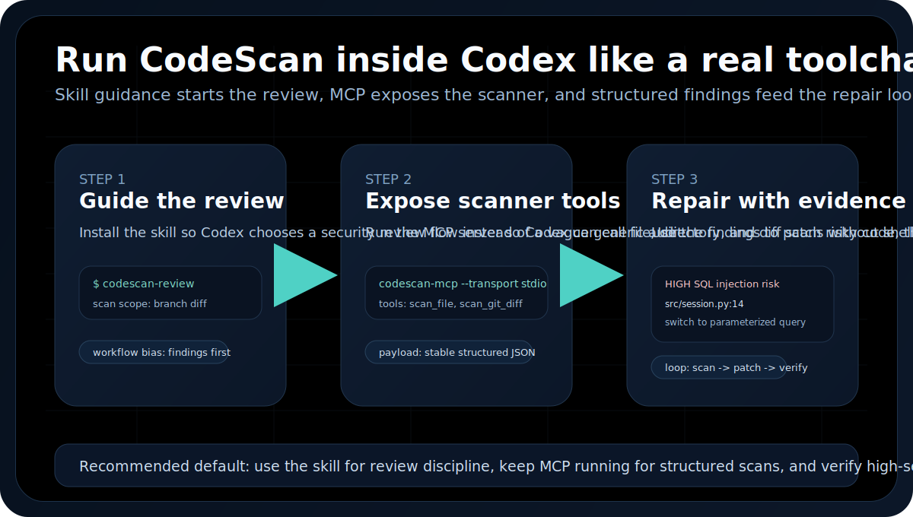
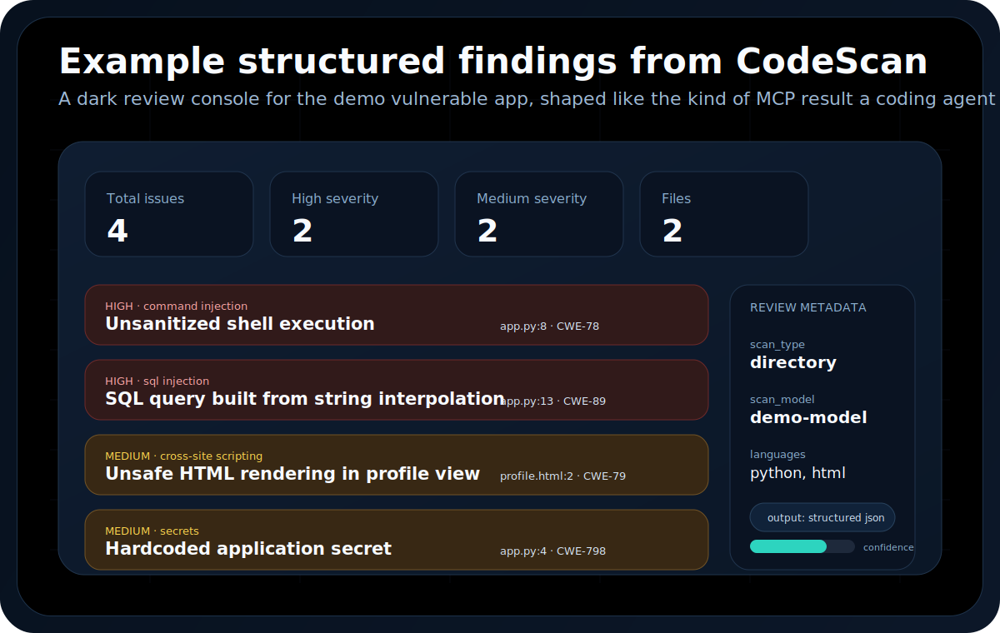

<p align="center">
  
</p>

<div align="center">

# CodeScan

English | [简体中文](README.zh-CN.md)

AI-assisted code security scanning for files, repositories, Git diffs, and coding agents.  
Start with deterministic rules, use LLM analysis to deepen context, and expose the scanner through MCP and a Codex skill.

[](https://github.com/HeJiguang/codescan/actions/workflows/ci.yml)


</div>

## Quick Links

- [Why CodeScan](#why-codescan)
- [Who This Is For](#who-this-is-for)
- [Try It In 5 Minutes](#try-it-in-5-minutes)
- [Quick Start](#quick-start)
- [Use With Codex](#use-with-codex)
- [Example Output](#example-output)
- [Get Involved](#get-involved)
- [Roadmap](#roadmap)

## Why CodeScan

Many AI code scanners are just chat wrappers around pasted source files. They can sound smart, but the output is unstable, difficult to integrate, and hard to trust in real workflows.

CodeScan takes a stricter route:

- Start with deterministic rule-based signal
- Use LLM analysis to deepen context and explanation
- Force structured output instead of free-form blob parsing
- Deliver the same result model through CLI, reports, MCP tools, and Codex workflows

The goal is not to be an unconstrained security agent. The goal is to be a practical, maintainable scanner that agents can actually use well.

## Who This Is For

CodeScan is most useful today for:

- developers who want a second security pass before merging code
- teams using Codex, Cursor, or Claude and wanting structured security tooling
- maintainers who want a lightweight repository triage tool without standing up a large platform
- contributors interested in security rules, AI-assisted analysis, or MCP-native developer tools

It is not yet positioned as a full replacement for mature enterprise SAST platforms. It is strongest as a high-leverage review assistant and agent-native scanning layer.

## Try It In 5 Minutes

If you just landed on this repo, do this first:

1. Browse the example fixture at [`examples/demo-vulnerable-app`](examples/demo-vulnerable-app)
2. Open the representative result at [`examples/sample-mcp-result.json`](examples/sample-mcp-result.json)
3. Read the visual walkthrough in [Example Output](docs/example-output.md)

If you want a real local run:

```bash
pip install -e .
python -m codescan config --provider deepseek --api-key YOUR_API_KEY --model deepseek-chat
python -m codescan dir examples/demo-vulnerable-app --output demo-result.json
```

That path is short on purpose. A tool gets adopted when people can reach their first believable result quickly.

## What Makes It Different

| Area | What it does now | Why it matters |
| --- | --- | --- |
| `LangChain` providers | Unifies DeepSeek, OpenAI, Anthropic, and OpenAI-compatible endpoints | Swap models without rewriting the scanner |
| `LangGraph` workflow | Models file analysis as `rule_scan -> llm_scan -> merge_and_finalize` | Gives the AI runtime a real pipeline instead of prompt spaghetti |
| `MCP Server` | Exposes structured scan tools for coding agents | Lets Codex and other MCP clients call CodeScan directly |
| `Skill layer` | Ships an installable `codescan-review` skill | Teaches Codex when to scan and how to present findings |
| Report system | Generates HTML / JSON / text output | Works for both humans and automation |
| Tests + CI | Verifies runtime, packaging, docs, and entry points | Keeps the repo from slipping back into prototype quality |

## Architecture



Core layout:

```text
codescan/
├── ai/
│   ├── providers.py
│   ├── prompts.py
│   ├── chains.py
│   ├── workflow.py
│   ├── schemas.py
│   └── service.py
├── scanner.py
├── report.py
├── vulndb.py
├── mcp_server.py
└── __main__.py

skills/
└── codescan-review/
```

## Quick Start

### 1. Clone

```bash
git clone https://github.com/HeJiguang/codescan.git
cd codescan
```

### 2. Install

```bash
python -m venv .venv

# Linux / macOS
source .venv/bin/activate

# Windows
.venv\Scripts\activate

pip install -e .
```

### 3. Configure a model

```bash
python -m codescan config --show
python -m codescan config --provider deepseek --api-key YOUR_DEEPSEEK_API_KEY --model deepseek-chat
```

### 4. Try the CLI

```bash
python -m codescan file /path/to/file.py
python -m codescan dir /path/to/project
python -m codescan git-merge main
```

### 5. Try the MCP server

```bash
codescan-mcp --transport stdio
```

## Use With Codex

<p align="center">
  
</p>

If you want CodeScan to feel native inside Codex, use both layers together:

1. Install the `codescan-review` skill
2. Run `codescan-mcp --transport stdio`
3. Ask Codex for a security review with a concrete scan scope

That gives Codex workflow guidance plus real structured scan tools.

Good starter prompts:

```text
Use $codescan-review to inspect the current branch against main and report only actionable security findings.

Use $codescan-review to inspect this file for security issues, especially trust boundaries and command execution risks.

Use $codescan-review to scan this repository and summarize the top security risks by severity.
```

More setup detail is in [Use With Codex](docs/codex.md), [MCP Guide](docs/mcp.md), and [Skill Guide](docs/skill.md).

## Can MCP Actually Improve Agent Security?

Yes, but only in a bounded and practical sense.

CodeScan can improve the safety of agent-authored code when the agent uses it at the right time and treats it as a review tool instead of a magic guarantee:

- highest value: scan the current branch or diff before merge
- strong value: scan a suspicious file that touches auth, SQL, shell execution, file handling, templating, or secrets
- lower value: run a broad repository sweep for intake or triage

What MCP changes is the integration cost. Instead of asking an agent to shell out, wait for reports, and parse result files, CodeScan can return structured findings directly in the review loop.

What MCP does not solve by itself:

- false positives from lightweight rule matching
- missing deeper data-flow or framework-aware analysis
- the need to manually verify high-severity findings before treating them as confirmed

In other words: MCP makes secure review workflows easier for agents to use consistently. It does not turn any scanner into a complete security gate on its own.

## Example Output

<p align="center">
  
</p>

This repo includes a tiny intentionally vulnerable fixture plus a representative structured scan result:

- [`examples/demo-vulnerable-app`](examples/demo-vulnerable-app)
- [`examples/sample-mcp-result.json`](examples/sample-mcp-result.json)

That gives visitors something concrete to inspect before they install or configure a model.

More detail is in [Example Output](docs/example-output.md).

## Get Involved

If you want more people to use an open-source tool, the first step is making it easy to understand and easy to contribute to. This repo now has MCP docs, Codex docs, example outputs, and an installable skill. The next growth comes from contributors.

Good ways to help:

- improve rule quality and reduce false positives
- add Semgrep or AST-backed checks
- improve GUI usability or split `gui.py`
- add benchmark repositories and evaluation fixtures
- improve docs, examples, onboarding, and Codex workflows

If you want to contribute, start here:

- [Contributing Guide](docs/CONTRIBUTING.md)
- [Good First Issues Guide](docs/good-first-issues.md)
- [MCP Guide](docs/mcp.md)
- [Skill Guide](docs/skill.md)
- the `good first issues` lane described in the contributing guide

If you find a bug or have an idea, use the GitHub issue templates in this repo. They are there to make outside participation easier, not heavier.

## What Ships Today

- Unified provider layer for modern chat models
- LangGraph-based file analysis workflow
- File, directory, GitHub repo, and Git diff scanning
- HTML / JSON / text report generation
- Desktop GUI
- MCP server with structured security tools
- Installable `codescan-review` skill for Codex
- Codex-specific setup guide and workflow visuals
- Demo vulnerable fixture and example MCP-style findings
- GitHub Actions CI and test coverage

## Quality Gate

```bash
python -m pytest tests -q
python -m compileall codescan
python -m codescan --help
python -m codescan mcp --help
```

## Roadmap

- [x] Rebuild the AI runtime with `LangChain + LangGraph`
- [x] Repair CLI / GUI / report-layer contract mismatches
- [x] Add packaging metadata, tests, and public CI
- [x] Publish an MCP server surface for coding agents
- [x] Publish an installable Codex skill
- [x] Add concrete example outputs to the repo homepage
- [ ] Strengthen rule trustworthiness with deeper Semgrep / AST review flows
- [ ] Add SARIF output and GitHub code scanning integration
- [ ] Continue splitting scan/export/settings logic out of `gui.py`
- [ ] Add benchmark repositories and repeatable evaluation fixtures

## Docs

- [Technical Doc](docs/technical_doc.md)
- [MCP Guide](docs/mcp.md)
- [Skill Guide](docs/skill.md)
- [Use With Codex](docs/codex.md)
- [Example Output](docs/example-output.md)
- [Good First Issues](docs/good-first-issues.md)
- [Contributing](docs/CONTRIBUTING.md)

## License

MIT. See [LICENSE](LICENSE).
