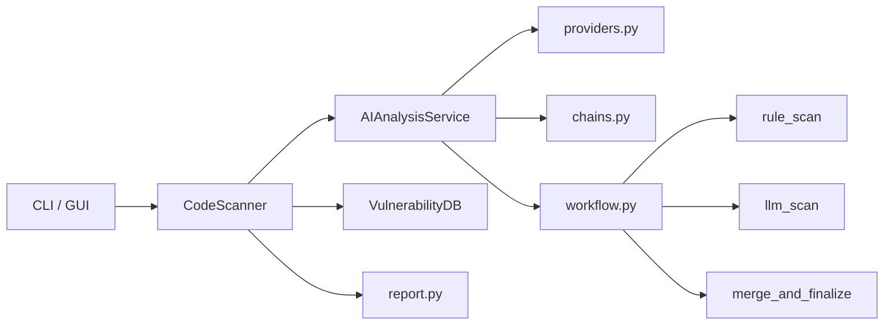

<p align="center">
  
</p>

<div align="center">

# CodeScan

面向代码仓库的 AI 安全扫描工具。  
用规则匹配打底，用大模型补足语义理解，把扫描结果统一输出为可读的报告。

[](https://github.com/HeJiguang/codescan/actions/workflows/ci.yml)


</div>

## Quick Links

- [Why CodeScan](#why-codescan)
- [Highlights](#highlights)
- [Architecture](#architecture)
- [Quick Start](#quick-start)
- [CLI Usage](#cli-usage)
- [Roadmap](#roadmap)

## Why CodeScan

很多“AI 扫码器”只是在代码上套一个聊天接口，看起来聪明，但结果不稳定、结构混乱、落不到工程里。

CodeScan 现在这条主线更克制一点：

- 先用规则层提供确定性
- 再用 LLM 做补充分析和解释
- 用结构化输出约束结果
- 最后统一进 CLI、GUI 和 HTML / JSON / 文本报告

它不是一个无边界的安全 Agent，而是一个更像产品的代码安全扫描器。

## Highlights

| 模块 | 现在能做什么 | 为什么有价值 |
| --- | --- | --- |
| `LangChain` 模型层 | 统一接入 DeepSeek / OpenAI / Anthropic / OpenAI-compatible 服务 | 换模型不需要改扫描主流程 |
| `LangGraph` 工作流 | 把文件分析拆成 `rule_scan -> llm_scan -> merge` | 以后继续加复核、去重、二次评分更顺 |
| `CLI + GUI` | 命令行和桌面界面都能跑 | 既适合本地工程流，也适合演示 |
| 报告系统 | HTML / JSON / 文本三种输出 | 可读、可集成、可留档 |
| 测试与 CI | pytest + GitHub Actions | 至少不是“改完只能靠手感” |

## Architecture



当前核心目录：

```text
codescan/
├── ai/
│   ├── providers.py
│   ├── prompts.py
│   ├── chains.py
│   ├── workflow.py
│   ├── schemas.py
│   └── service.py
├── scanner.py
├── report.py
├── vulndb.py
├── gui.py
└── __main__.py
```

## Quick Start

### 1. Clone

```bash
git clone https://github.com/HeJiguang/codescan.git
cd codescan
```

### 2. Install

```bash
python -m venv .venv

# Linux / macOS
source .venv/bin/activate

# Windows
.venv\Scripts\activate

pip install -r requirements.txt
```

也可以走标准包方式：

```bash
pip install -e .
```

### 3. Configure A Model

```bash
# 查看当前配置
python -m codescan config --show

# DeepSeek
python -m codescan config --provider deepseek --api-key YOUR_DEEPSEEK_API_KEY --model deepseek-chat

# OpenAI
python -m codescan config --provider openai --api-key YOUR_OPENAI_API_KEY --model gpt-4o-mini --base-url https://api.openai.com/v1

# 代理
python -m codescan config --http-proxy http://127.0.0.1:7890
```

## CLI Usage

```bash
# 扫描单文件
python -m codescan file /path/to/file.py

# 扫描目录
python -m codescan dir /path/to/project

# 扫描 GitHub 仓库
python -m codescan github https://github.com/HeJiguang/codescan.git

# 比较当前分支与 main 的差异文件
python -m codescan git-merge main

# 输出 JSON 报告
python -m codescan file /path/to/file.py --output result.json

# 打开 GUI
python -m codescan gui
```

## What Ships Today

- 统一模型接入
- 文件级 AI 工作流
- 目录级扫描聚合
- HTML / JSON / 文本报告
- GitHub Actions CI
- `pyproject.toml` 和 console script

## Rule System

CodeScan 目前是三层能力叠加：

1. 内置规则库
2. Semgrep 规则导入
3. LLM 深度分析

```bash
# 更新漏洞库
python -m codescan update

# 从 URL 导入规则
python -m codescan import-rule https://example.com/rules.yaml

# 从 GitHub 导入 Semgrep 规则
python -m codescan import-github --repo-url https://github.com/returntocorp/semgrep-rules --branch main
```

## Quality Gate

```bash
python -m pytest tests -q
python -m compileall codescan
python -m codescan --help
```

## Roadmap

- [x] 用 `LangChain + LangGraph` 重构 AI runtime
- [x] 修正 CLI / GUI / 报告层契约不一致
- [x] 补上测试、CI、包分发元数据
- [x] 开始拆 `gui.py` 的纯展示逻辑
- [ ] 继续拆 GUI 的扫描完成 / 导出 / 设置逻辑
- [ ] 增加样例报告和 README 截图
- [ ] 把规则层升级为更可信的 Semgrep / AST 复核流

## Docs

- [技术文档](docs/technical_doc.md)
- [文档索引](docs/README.md)
- [规则编写指南](docs/rules_guide.md)
- [贡献指南](docs/CONTRIBUTING.md)

## License

MIT，见 [LICENSE](LICENSE)。
