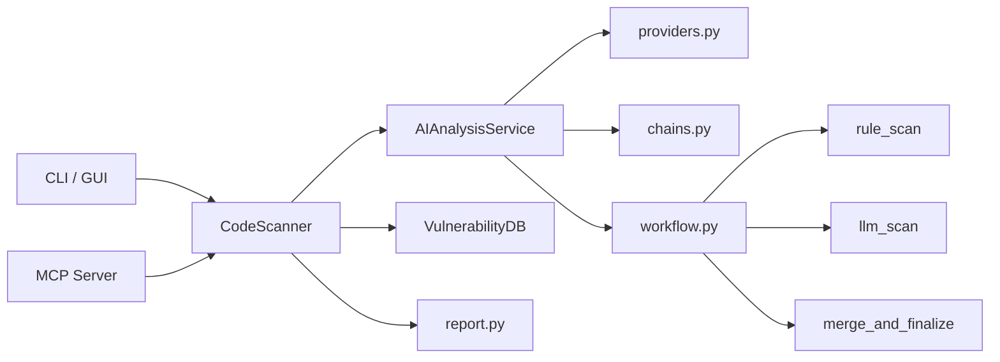

<p align="center">
  
</p>

<div align="center">

# CodeScan

AI-assisted code security scanning for repositories, files, and Git diffs.  
规则层先落地，LLM 层再补语义分析；现在还可以直接作为 MCP server 接进 Codex、Cursor、Claude 等 agent 工作流。

[](https://github.com/HeJiguang/codescan/actions/workflows/ci.yml)


</div>

## Quick Links

- [Why CodeScan](#why-codescan)
- [Highlights](#highlights)
- [Architecture](#architecture)
- [Quick Start](#quick-start)
- [CLI Usage](#cli-usage)
- [MCP Server](#mcp-server)
- [Skill](#skill)
- [Codex](#use-with-codex)
- [Quality Gate](#quality-gate)
- [Roadmap](#roadmap)

## Why CodeScan

Many “AI code scanners” are just chat wrappers around a code dump. They can sound smart, but the output is unstable, hard to integrate, and difficult to maintain.

CodeScan takes a stricter route:

- Start with deterministic rule-based signal.
- Use LLM analysis to deepen context and explanation.
- Force structured output instead of free-form blob parsing.
- Deliver the same result model through CLI, GUI, reports, and now MCP tools.

The goal is not to be an unconstrained security agent. The goal is to be a maintainable scanner that agents can also use well.

## Highlights

| Area | What it does now | Why it matters |
| --- | --- | --- |
| `LangChain` providers | Unifies DeepSeek, OpenAI, Anthropic, and OpenAI-compatible endpoints | Swap models without rewriting the scanner |
| `LangGraph` workflow | Models file analysis as `rule_scan -> llm_scan -> merge_and_finalize` | Gives the AI runtime a real pipeline instead of prompt spaghetti |
| `CLI + GUI` | Supports command-line and desktop use | Useful both for real workflows and demos |
| `MCP Server` | Exposes structured scan tools for coding agents | Lets Codex and other MCP clients call CodeScan directly |
| Report system | Generates HTML / JSON / text output | Human-readable and automation-friendly |
| Tests + CI | Verifies runtime, packaging, and CLI entry points | Keeps the repo from drifting back into prototype quality |

## Architecture



Core layout:

```text
codescan/
├── ai/
│   ├── providers.py
│   ├── prompts.py
│   ├── chains.py
│   ├── workflow.py
│   ├── schemas.py
│   └── service.py
├── scanner.py
├── report.py
├── vulndb.py
├── mcp_server.py
├── gui.py
└── __main__.py
```

## Quick Start

### 1. Clone

```bash
git clone https://github.com/HeJiguang/codescan.git
cd codescan
```

### 2. Install

```bash
python -m venv .venv

# Linux / macOS
source .venv/bin/activate

# Windows
.venv\Scripts\activate

pip install -r requirements.txt
```

Or install it as a package:

```bash
pip install -e .
```

### 3. Configure A Model

```bash
# Show current configuration
python -m codescan config --show

# DeepSeek
python -m codescan config --provider deepseek --api-key YOUR_DEEPSEEK_API_KEY --model deepseek-chat

# OpenAI
python -m codescan config --provider openai --api-key YOUR_OPENAI_API_KEY --model gpt-4o-mini --base-url https://api.openai.com/v1

# Proxy
python -m codescan config --http-proxy http://127.0.0.1:7890
```

## CLI Usage

```bash
# Scan one file
python -m codescan file /path/to/file.py

# Scan a directory
python -m codescan dir /path/to/project

# Scan a GitHub repository
python -m codescan github https://github.com/HeJiguang/codescan.git

# Review the current branch against main
python -m codescan git-merge main

# Write a JSON report
python -m codescan file /path/to/file.py --output result.json

# Launch the GUI
python -m codescan gui
```

## MCP Server

CodeScan can now run as an MCP server, which means coding agents can call the scanner directly and receive structured results instead of shelling out to the CLI and parsing report files afterward.

### Start With `stdio`

```bash
python -m codescan mcp --transport stdio
```

After `pip install -e .`, you can also use the dedicated script:

```bash
codescan-mcp --transport stdio
```

### HTTP Transports

```bash
codescan-mcp --transport streamable-http --host 127.0.0.1 --port 8000
codescan-mcp --transport sse --host 127.0.0.1 --port 8000
```

### Available MCP Tools

- `scan_file(path, model="default")`
- `scan_directory(path, model="default", max_workers=4)`
- `scan_git_diff(base_branch, repo_path=".", model="default")`
- `scan_github_repo(repo_url, model="default", max_workers=4)`

Each tool returns structured scan output with top-level fields such as `issues`, `stats`, `project_info`, `total_issues`, and `issues_by_severity`.

More detail is available in [docs/mcp.md](docs/mcp.md).

## Skill

CodeScan also ships an installable Codex skill at [`skills/codescan-review`](skills/codescan-review/SKILL.md).

This skill is designed to sit on top of the MCP server:

- MCP gives Codex real CodeScan tools
- the skill teaches Codex when to use them and how to present the findings

Install it from this repo with Codex's GitHub skill installer:

```bash
install-skill-from-github.py --repo HeJiguang/codescan --path skills/codescan-review
```

Then restart Codex to pick up the installed skill.

More detail is available in [docs/skill.md](docs/skill.md).

## Use With Codex

<p align="center">
  
</p>

If you want CodeScan to feel native inside Codex, use both layers together:

1. Install the `codescan-review` skill
2. Run `codescan-mcp --transport stdio`
3. Ask Codex for a security review with a concrete scan scope

That gives Codex workflow guidance plus real structured scan tools.

Good starter prompts:

```text
Use $codescan-review to inspect the current branch against main and report only actionable security findings.

Use $codescan-review to inspect this file for security issues, especially trust boundaries and command execution risks.

Use $codescan-review to scan this repository and summarize the top security risks by severity.
```

Full setup notes and more example prompts are in [Use With Codex](docs/codex.md).

## What Ships Today

- Unified provider layer for modern chat models
- LangGraph-based file analysis workflow
- File, directory, GitHub repo, and Git diff scanning
- HTML / JSON / text report generation
- Desktop GUI
- MCP server with structured security tools
- Installable `codescan-review` skill for Codex
- Codex-specific setup guide and workflow visual
- `pyproject.toml` packaging and console scripts
- GitHub Actions CI and test coverage

## Rule System

CodeScan currently layers three analysis sources:

1. Built-in vulnerability rules
2. Imported Semgrep-compatible rule sets
3. LLM-assisted semantic analysis

```bash
# Update the vulnerability database
python -m codescan update

# Import rules from a URL
python -m codescan import-rule https://example.com/rules.yaml

# Import Semgrep rules from GitHub
python -m codescan import-github --repo-url https://github.com/returntocorp/semgrep-rules --branch main
```

## Quality Gate

```bash
python -m pytest tests -q
python -m compileall codescan
python -m codescan --help
python -m codescan mcp --help
```

## Roadmap

- [x] Rebuild the AI runtime with `LangChain + LangGraph`
- [x] Repair CLI / GUI / report-layer contract mismatches
- [x] Add packaging metadata, tests, and public CI
- [x] Extract GUI presentation helpers out of the giant `gui.py`
- [x] Publish an MCP server surface for coding agents
- [ ] Continue splitting scan/export/settings logic out of `gui.py`
- [ ] Add screenshots and example reports to the README
- [ ] Strengthen rule trustworthiness with deeper Semgrep / AST review flows
- [ ] Add benchmark repositories and repeatable evaluation fixtures

## Docs

- [Technical Doc](docs/technical_doc.md)
- [MCP Guide](docs/mcp.md)
- [Skill Guide](docs/skill.md)
- [Use With Codex](docs/codex.md)
- [Docs Index](docs/README.md)
- [Rules Guide](docs/rules_guide.md)
- [Contributing](docs/CONTRIBUTING.md)

## License

MIT. See [LICENSE](LICENSE).
