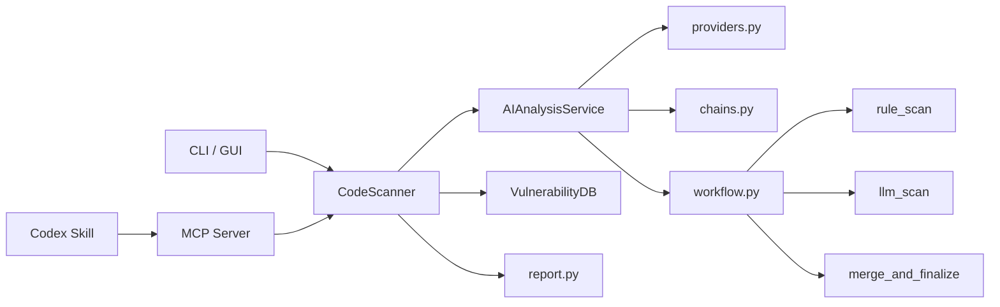

<p align="center">
  
</p>

<div align="center">

# CodeScan

[English](README.md) | 简体中文

面向文件、仓库、Git 差异和编码代理的 AI 辅助代码安全扫描工具。  
先用规则信号做初筛，再用 LLM 做语义补强，并通过 MCP 与 Codex Skill 接入 agent 工作流。
[](https://github.com/HeJiguang/codescan/actions/workflows/ci.yml)


</div>

## 快速入口

- [为什么是 CodeScan](#为什么是-codescan)
- [适合什么人](#适合什么人)
- [5 分钟体验](#5-分钟体验)
- [快速开始](#快速开始)
- [与 Codex 配合](#与-codex-配合)
- [作为 MCP 工具，真的能提高 agent 写代码的安全性吗](#作为-mcp-工具真的能提高-agent-写代码的安全性吗)
- [示例输出](#示例输出)
- [还值得继续改进的地方](#还值得继续改进的地方)
- [参与贡献](#参与贡献)
- [路线图](#路线图)

## 为什么是 CodeScan

很多所谓的 AI 代码扫描器，本质上只是把源代码贴给聊天模型，然后生成一段听起来很聪明的安全建议。这样做的问题很明显：

- 结果不稳定
- 很难接入真实工作流
- 输出往往不够结构化
- 结论很难被 agent 稳定复用

CodeScan 走的是一条更克制的路线：

- 先用确定性的规则信号打底
- 再用 LLM 补充上下文和解释
- 强制结构化输出，而不是一团自由文本
- 让 CLI、报告、MCP 工具、Codex Skill 共享同一套结果模型

当前重点是把规则扫描、结构化结果和 agent 工作流接起来。

## 适合什么人

当前阶段的 CodeScan 更适合下面这些场景：

- 开发者在合并前想多做一次安全复查
- 团队已经在用 Codex、Cursor、Claude，希望给 agent 增加一个结构化安全审查工具
- 维护者希望快速扫一下仓库风险，而不是搭一整套大型平台
- 对安全规则、AI 辅助分析、MCP 原生工具感兴趣的贡献者

当前更适合作为安全审查助手和 agent-native 的扫描能力层，而不是成熟企业级 SAST 平台的替代品。

## 5 分钟体验

建议先看这三样东西：

1. 浏览示例漏洞项目 [`examples/demo-vulnerable-app`](examples/demo-vulnerable-app)
2. 打开代表性结果 [`examples/sample-mcp-result.json`](examples/sample-mcp-result.json)
3. 阅读可视化说明 [Example Output](docs/example-output.md)

如果你想本地跑一次：

```bash
pip install -e .
python -m codescan config --provider deepseek --api-key YOUR_API_KEY --model deepseek-chat
python -m codescan dir examples/demo-vulnerable-app --output demo-result.json
```

## 它和常见 AI 扫描器有什么不同

| 维度 | 当前能力 | 为什么重要 |
| --- | --- | --- |
| `LangChain` provider 层 | 统一 DeepSeek、OpenAI、Anthropic 与 OpenAI-compatible 接口 | 方便切模型，不需要重写扫描器 |
| `LangGraph` 工作流 | 文件分析建模为 `rule_scan -> llm_scan -> merge_and_finalize` | 比单纯 prompt 拼接更稳定 |
| `MCP Server` | 暴露结构化扫描工具给编码 agent | 让 Codex 等客户端直接调用 |
| `Skill` 层 | 提供可安装的 `codescan-review` skill | 让 Codex 更容易在对的时机发起扫描 |
| 报告系统 | 支持 HTML / JSON / 文本 | 兼顾人看和自动化处理 |
| 测试与 CI | 覆盖运行时、打包、文档、入口 | 降低项目回到原型状态的风险 |

## 架构概览



核心目录：

```text
codescan/
|-- ai/
|   |-- providers.py
|   |-- prompts.py
|   |-- chains.py
|   |-- workflow.py
|   |-- schemas.py
|   `-- service.py
|-- scanner.py
|-- report.py
|-- vulndb.py
|-- mcp_server.py
`-- __main__.py

skills/
`-- codescan-review/
```

## 快速开始

### 1. 克隆仓库

```bash
git clone https://github.com/HeJiguang/codescan.git
cd codescan
```

### 2. 安装依赖

```bash
python -m venv .venv

# Linux / macOS
source .venv/bin/activate

# Windows
.venv\Scripts\activate

pip install -e .
```

### 3. 配置模型

```bash
python -m codescan config --show
python -m codescan config --provider deepseek --api-key YOUR_DEEPSEEK_API_KEY --model deepseek-chat
```

### 4. 使用 CLI

```bash
python -m codescan file /path/to/file.py
python -m codescan dir /path/to/project
python -m codescan git-merge main
```

### 5. 启动 MCP 服务

```bash
codescan-mcp --transport stdio
```

## 与 Codex 配合

<p align="center">
  
</p>

在 Codex 中使用 CodeScan，建议把这两层一起打开：

1. 安装 `codescan-review` skill
2. 启动 `codescan-mcp --transport stdio`
3. 用明确的扫描范围提示 Codex 发起安全审查

推荐起手式：

```text
Use $codescan-review to inspect the current branch against main and report only actionable security findings.

Use $codescan-review to inspect this file for security issues, especially trust boundaries and command execution risks.

Use $codescan-review to scan this repository and summarize the top security risks by severity.
```

更详细的接入说明：

- [Use With Codex](docs/codex.md)
- [MCP Guide](docs/mcp.md)
- [Skill Guide](docs/skill.md)

## 作为 MCP 工具，真的能提高 agent 写代码的安全性吗

能，但前提是把它放在审查流程里用。

CodeScan 作为 MCP 工具，真实能带来的改进主要有三类：

- 降低调用成本：agent 不需要 shell 出去跑命令、等报告落盘、再手工解析结果
- 提高使用频率：结构化工具更容易被放进 review loop，而不是“想起来才用一次”
- 提高反馈质量：返回的是带严重级别、文件位置、建议修复的结构化结果，agent 更容易继续追踪和修改

最有效的使用方式通常不是“全仓乱扫”，而是：

- 最高价值：在提交前或合并前扫描当前 diff
- 很高价值：扫描 auth、SQL、命令执行、模板渲染、文件操作、secret 处理这些高风险文件
- 中等价值：做仓库 intake 或初步 triage

但它不能被误解成“接了 MCP 就能保证 agent 写出安全代码”。

它现在还不能替代的部分包括：

- 轻量规则带来的误报
- 缺少更深的数据流、框架语义和污点传播分析
- 高危问题仍然需要人工或二次审查确认
- 没有把“扫描失败或高危结果阻断输出”做成强制工作流

更准确的说法是：

CodeScan 能提高 agent 发现明显安全问题的概率，也能让安全审查更容易嵌入编码流程；但它目前仍然是“安全审查助手”，不是“完整安全闸门”。

## 示例输出

<p align="center">
  
</p>

仓库里已经带了一个故意保留漏洞的极小示例项目，以及一份代表性的结构化结果：

- [`examples/demo-vulnerable-app`](examples/demo-vulnerable-app)
- [`examples/sample-mcp-result.json`](examples/sample-mcp-result.json)

你可以先看输出长什么样，再决定是否安装和接入。

## 当前已经提供的能力

- 统一的现代聊天模型 provider 层
- 基于 LangGraph 的文件分析流程
- 文件、目录、GitHub 仓库、Git diff 扫描
- HTML / JSON / 文本报告输出
- 桌面 GUI
- MCP Server
- 可安装的 `codescan-review` skill
- 面向 Codex 的接入文档和示例
- 示例漏洞项目和示例扫描结果
- GitHub Actions CI 与测试覆盖

## 还值得继续改进的地方

如果继续把这个项目往“更可用的 agent 安全层”推进，我认为优先级最高的是这几件事：

- 提高规则可信度
  - 引入更深的 Semgrep / AST 复核
  - 减少 README、注释、示例文本被误报命中的情况
- 增强扫描结果的工程接入能力
  - 补 SARIF 输出
  - 更顺滑地接入 GitHub code scanning 或其他 CI 平台
- 把 agent 工作流做得更强约束
  - 默认优先 `scan_git_diff`
  - 对 `critical` / `high` 的发现增加明确复核与阻断建议
- 建立真实 benchmark
  - 增加样例仓库、误报统计、截图和对照结果
- 继续拆分维护压力过高的模块
  - 比如当前 GUI 文件依然偏大，后续可以继续按职责拆分

## 参与贡献

当前优先欢迎的贡献方向包括：

- 提高规则质量，降低误报
- 增加 Semgrep 或 AST 驱动的检测
- 改善 GUI 可维护性和使用体验
- 增加 benchmark 仓库和评估样本
- 改善文档、示例和 agent 工作流

入门建议从这里看：

- [Contributing Guide](docs/CONTRIBUTING.md)
- [Good First Issues Guide](docs/good-first-issues.md)
- [MCP Guide](docs/mcp.md)
- [Skill Guide](docs/skill.md)

## 路线图

- [x] 用 `LangChain + LangGraph` 重建 AI 运行时
- [x] 修复 CLI / GUI / 报告层之间的契约不一致
- [x] 补齐打包元数据、测试和公共 CI
- [x] 发布面向编码 agent 的 MCP 接口
- [x] 发布可安装的 Codex skill
- [x] 为仓库首页补示例输出
- [ ] 进一步提高规则可信度，接入更深的 Semgrep / AST 流程
- [ ] 增加 SARIF 输出与 GitHub code scanning 集成
